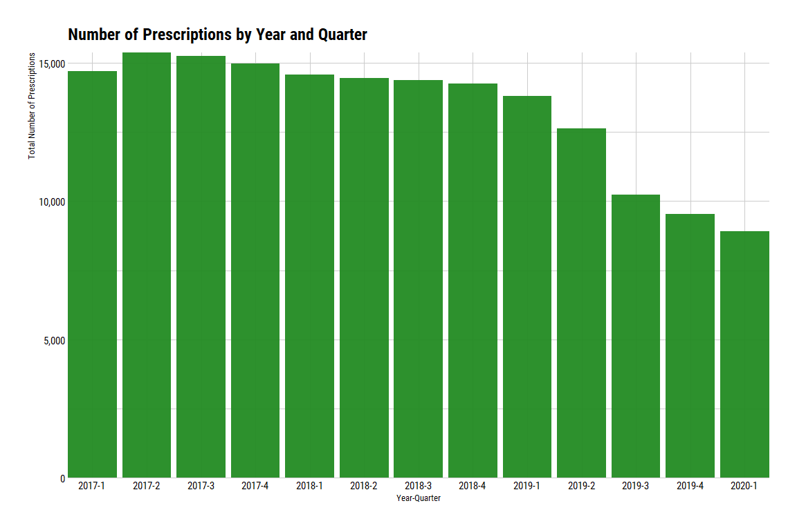
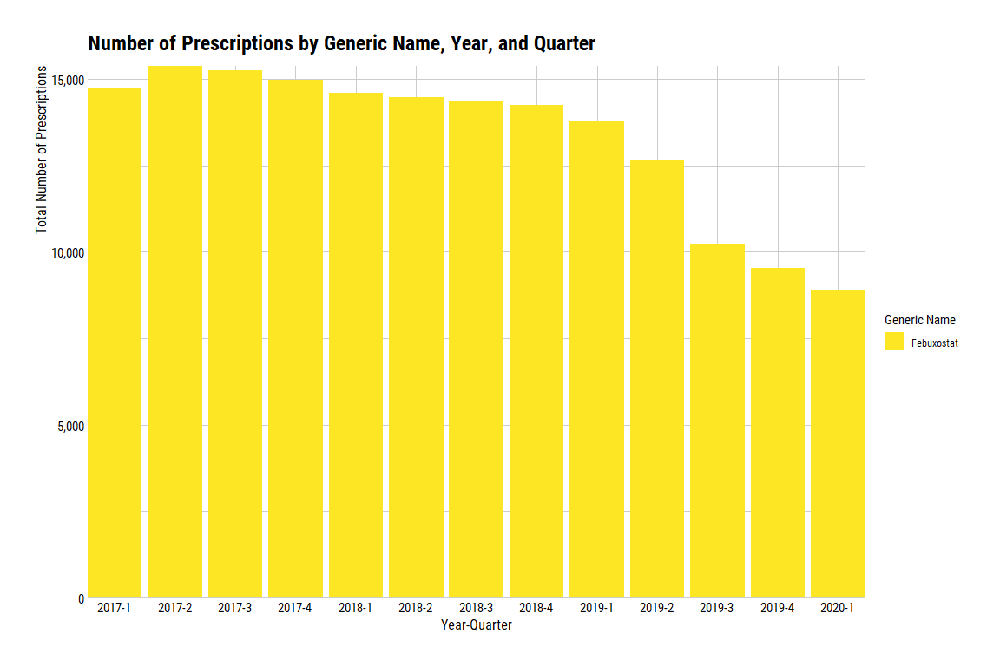
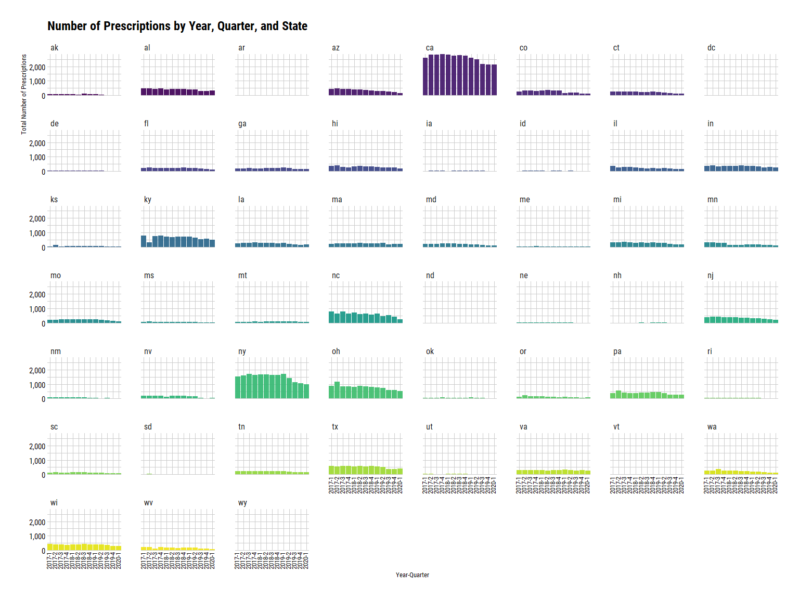

Febuxostat Q1 2017 - Q1 2020
================
Michael Maguire, MS
3/16/2021

## Request Prompt:

Can you please cut the SDUD data to get only prescriptions for
“febuxostat” (brand name “uloric”) from Q12017 to Q12020 (each state)?
Please include those that have suppressed records too.

### Load libraries

``` r
library(dplyr)
library(ggplot2)
library(hrbrthemes)
library(purrr)
library(readr)
library(stringr)
library(tidylog)
library(viridis)
```

### Step 1: Pull in SDUD dataset.

Note: location of data set is a personal directory, so I have masked it.

``` r
sdud_2017_2020 <-
  read_rds(
    file = loc
  ) %>%
  filter(year %in% c(2017:2019) | year == 2020 & quarter == 1)
```

    ## filter: removed 49,143,143 rows (77%), 14,574,088 rows remaining

Examine years and quarters to ensure the correct period is pulled.

``` r
sdud_2017_2020 %>%
  distinct(year, quarter) %>%
  arrange(year, desc(quarter))
```

    ## distinct: removed 14,574,075 rows (>99%), 13 rows remaining

    ## # A tibble: 13 x 2
    ##     year quarter
    ##    <int>   <int>
    ##  1  2017       4
    ##  2  2017       3
    ##  3  2017       2
    ##  4  2017       1
    ##  5  2018       4
    ##  6  2018       3
    ##  7  2018       2
    ##  8  2018       1
    ##  9  2019       4
    ## 10  2019       3
    ## 11  2019       2
    ## 12  2019       1
    ## 13  2020       1

### Step 2: Flag records containing generic name.

``` r
sdud_2017_2020_gennmes <- 
  sdud_2017_2020 %>%
  mutate(
    febuxostat_flag = case_when(
      str_detect(string = gennme_c, pattern = regex("febuxostat", ignore_case = TRUE)) ~ "1",
      TRUE ~ "0"
    )
  )
```

    ## mutate: new variable 'febuxostat_flag' (character) with 2 unique values and 0% NA

Checking flags.

``` r
sdud_2017_2020_gennmes %>%
  select(febuxostat_flag) %>%
  map(., janitor::tabyl)
```

    ## select: dropped 32 variables (utilization_type, state, year, quarter, number_of_prescriptions, …)

    ## $febuxostat_flag
    ##  .x[[i]]        n      percent
    ##        0 14571270 0.9998066431
    ##        1     2818 0.0001933569

### Step 3: Aggregate by state, year, quarter and sum.

``` r
# Filter off on flags created above.
sdud_2017_2020_febux_flags <-
  sdud_2017_2020_gennmes %>%
  filter(
    febuxostat_flag == "1"
  )
```

    ## filter: removed 14,571,270 rows (>99%), 2,818 rows remaining

``` r
# Create data set containing generic name, brand name, and ndc number.
ndc_gen_brand_names <- 
  sdud_2017_2020_febux_flags %>%
  distinct(gennme_c, prodnme, ndc)
```

    ## distinct: removed 2,806 rows (>99%), 12 rows remaining

``` r
# Examine data set.
ndc_gen_brand_names
```

    ## # A tibble: 12 x 3
    ##    ndc         gennme_c   prodnme   
    ##    <chr>       <chr>      <chr>     
    ##  1 00378392693 Febuxostat FEBUXOSTAT
    ##  2 62332019130 Febuxostat FEBUXOSTAT
    ##  3 00378392593 Febuxostat FEBUXOSTAT
    ##  4 47335072183 Febuxostat FEBUXOSTAT
    ##  5 62332019030 Febuxostat FEBUXOSTAT
    ##  6 72205002930 Febuxostat FEBUXOSTAT
    ##  7 47335072283 Febuxostat FEBUXOSTAT
    ##  8 64764091830 Febuxostat ULORIC    
    ##  9 00054041313 Febuxostat FEBUXOSTAT
    ## 10 72205002830 Febuxostat FEBUXOSTAT
    ## 11 64764067730 Febuxostat ULORIC    
    ## 12 00054041413 Febuxostat FEBUXOSTAT

``` r
# Create aggregate by state, year, quarter, and suppression.
sdud_2017_2020_febux_rx <-
  sdud_2017_2020_febux_flags %>%
  group_by(state, year, quarter, gennme_c, suppression_used) %>%
  summarize(total_prescriptions = sum(number_of_prescriptions))
```

    ## group_by: 5 grouping variables (state, year, quarter, gennme_c, suppression_used)

    ## summarize: now 988 rows and 6 columns, 4 group variables remaining (state, year, quarter, gennme_c)

``` r
# Create aggregate by state, year, quarter, generic name, and suppression. 
sdud_2017_2020_febux <- 
  sdud_2017_2020_febux_flags %>%
  group_by(state, year, quarter, suppression_used) %>%
  summarize(total_prescriptions = sum(number_of_prescriptions))
```

    ## group_by: 4 grouping variables (state, year, quarter, suppression_used)

    ## summarize: now 988 rows and 5 columns, 3 group variables remaining (state, year, quarter)

### Step 4: Plot number of prescriptions over time.

``` r
# Plot showing number of prescriptions by year and quarter.
ggplot(data = sdud_2017_2020_febux) +
  geom_col(aes(x = paste0(year, "-", quarter), y = total_prescriptions), fill = "forestgreen", alpha = 0.95) +
    scale_y_continuous(labels = scales::comma) + 
    theme_ipsum_rc(axis_title_just = "ct") +
    ggtitle("Number of Prescriptions by Year and Quarter") +
    xlab("Year-Quarter") +
    ylab("Total Number of Prescriptions") +
    theme(
      axis.text.x = element_text(color = "black"),
      axis.text.y = element_text(color = "black"),
      axis.title.x = element_text(color = "black", size = 10),
      axis.title.y = element_text(color = "black", size = 10),
    ) +
    coord_cartesian(expand = FALSE)
```

<!-- -->

``` r
# Plot showing number of prescriptions by year, quarter, and generic name.
ggplot(data = sdud_2017_2020_febux_rx) +
  geom_col(aes(x = paste0(year, "-", quarter), y = total_prescriptions, fill = gennme_c)) +
    scale_fill_viridis_d(direction = -1) +
    scale_y_continuous(labels = scales::comma) +
    theme_ipsum_rc(axis_title_just = "ct") +
    ggtitle("Number of Prescriptions by Generic Name, Year, and Quarter") +
    xlab("Year-Quarter") +
    ylab("Total Number of Prescriptions") +
    labs(fill = "Generic Name") +
    theme(
      axis.text.x = element_text(color = "black"),
      axis.text.y = element_text(color = "black"),
      axis.title.x = element_text(color = "black", size = 12),
      axis.title.y = element_text(color = "black", size = 12)
    ) +
    coord_cartesian(expand = FALSE)
```

<!-- -->

``` r
# Plot showing number of prescriptions by year, quarter, and state.
ggplot(data = sdud_2017_2020_febux) +
  geom_col(aes(x = paste0(year, "-", quarter), y = total_prescriptions, fill = state), alpha = 0.95) +
    scale_fill_viridis_d() +
    scale_y_continuous(labels = scales::comma) + 
    theme_ipsum_rc(axis_title_just = "ct") +
    ggtitle("Number of Prescriptions by Year, Quarter, and State") +
    xlab("Year-Quarter") +
    ylab("Total Number of Prescriptions") +
    theme(
      axis.text.x = element_text(color = "black", angle = 90, size = 10, hjust = 0.25, vjust = 0.25),
      axis.text.y = element_text(color = "black"),
      axis.title.x = element_text(color = "black", size = 10),
      axis.title.y = element_text(color = "black", size = 10),
      legend.position = "none"
    ) +
    facet_wrap(~state) +
    coord_cartesian(expand = FALSE)
```

<!-- -->
